# Grocery App using Flask

A web-based grocery store management system built with Flask and SQLite. This application allows users to register, log in, browse products by category, add items to their cart, place orders, and manage their profiles. Admin users can manage categories and products.

---
### Reach Out
If you have questions, suggestions, or just want to connect, feel free to reach out to me on [LinkedIn](https://www.linkedin.com/in/subham-kumar-056466275/).

---

A web-based grocery store management system built with Flask and SQLite. This application allows users to register, log in, browse products by category, add items to their cart, place orders, and manage their profiles. Admin users can manage categories and products.

## Features


## Technologies Used


## Project Structure

```
app.py                # Main Flask application
config.py             # Configuration file
instance/groceri.db   # SQLite database
/templates/           # HTML templates (Jinja2)
/screenshots/         # App screenshots
```

## Getting Started

1. **Clone the repository**
2. **Create a virtual environment and activate it**
3. **Install dependencies**
4. **Run the app**

```bash
python3 -m venv env
source env/bin/activate
pip install flask flask_sqlalchemy python-dotenv
python app.py
```

The app will be available at `http://127.0.0.1:5000/`.

## Screenshots

Below are screenshots of the main features and pages:

| Add Product           | Admin Categories      | Admin Dashboard      | Admin Products        |
|----------------------|----------------------|---------------------|----------------------|
| 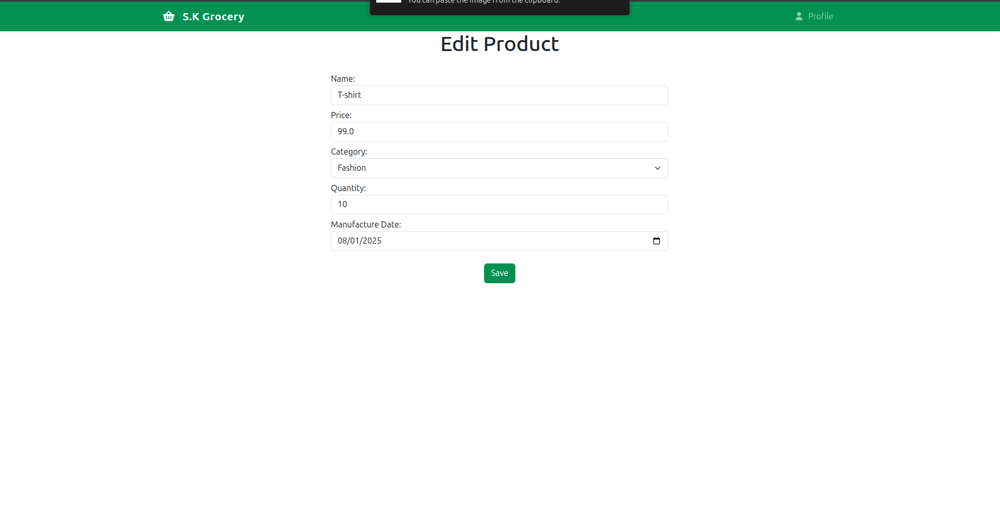 | 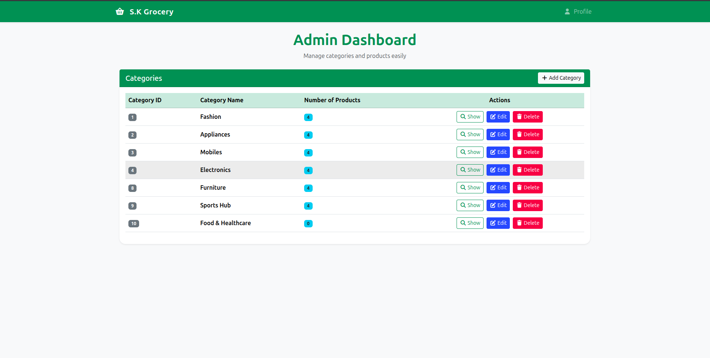 | 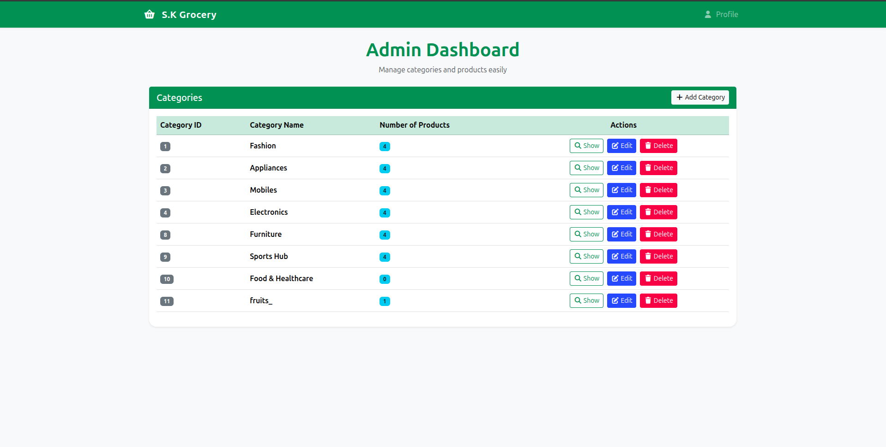 | 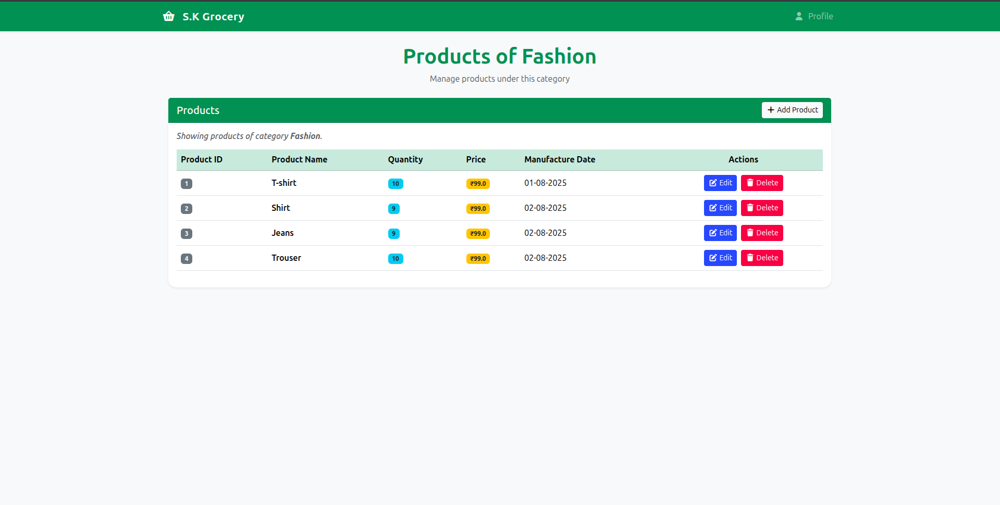 |

| Cart                 | Delete Category       | Login               | Orders               |
|----------------------|----------------------|---------------------|----------------------|
| 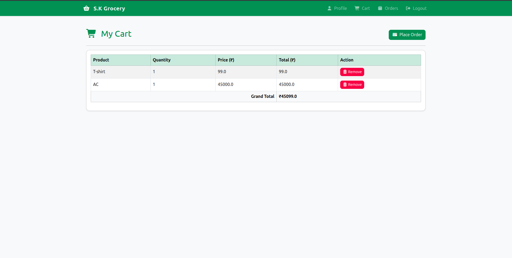 | 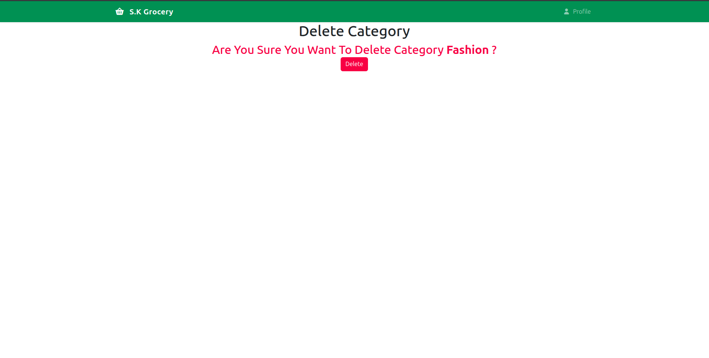 | 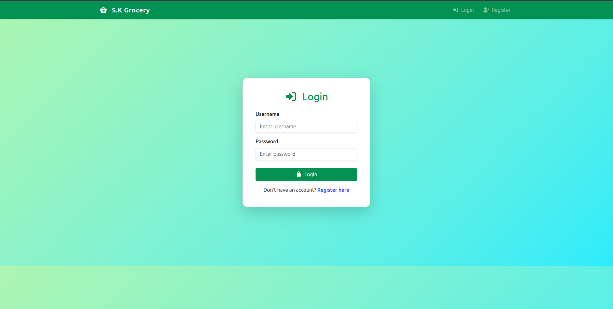 | 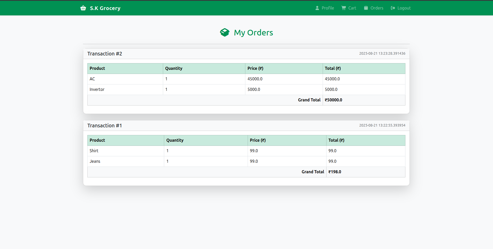 |

| Profile              | Register             | User Dashboard      |
|----------------------|----------------------|---------------------|
| 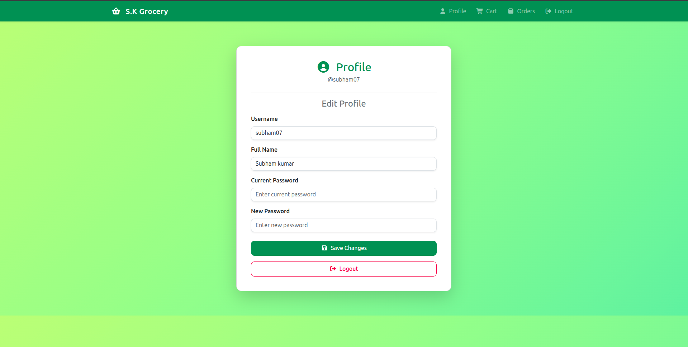 | 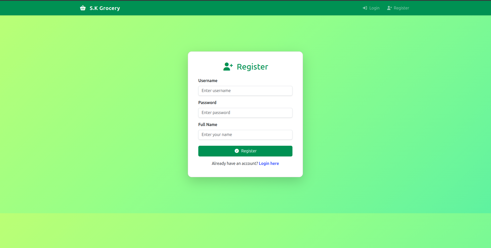 | 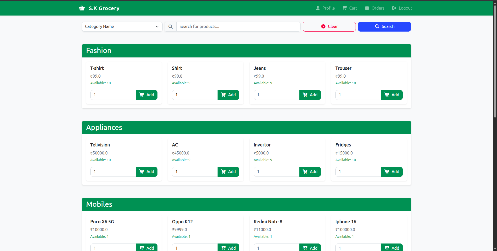 |

## Database Models

- **User**: Stores user info, hashed password, admin flag
- **Product**: Product details, category, price, quantity, manufacture date
- **Category**: Product categories
- **Cart**: User's cart items
- **Transaction**: Order transactions
- **Order**: Items in each transaction

## Main Routes

- `/` : User dashboard (product browsing/search)
- `/login`, `/register`, `/logout` : Auth routes
- `/profile` : User profile
- `/cart` : User cart
- `/orders` : User order history
- `/admin` : Admin dashboard
- `/category/*` : Category management (admin)
- `/product/*` : Product management (admin)

## Customization
- Update `config.py` or `.env` for database URI and secret key.
- Modify templates in `/templates/` for UI changes.

## License


---
###  Bootcamp Experience
This project was built in just three days as part of an intensive bootcamp. Special thanks to [Rajnish](https://www.linkedin.com/in/0rajnishk) ([GitHub](https://github.com/0rajnishk/)) for the mentorship, guidance, and inspiration throughout the process!
